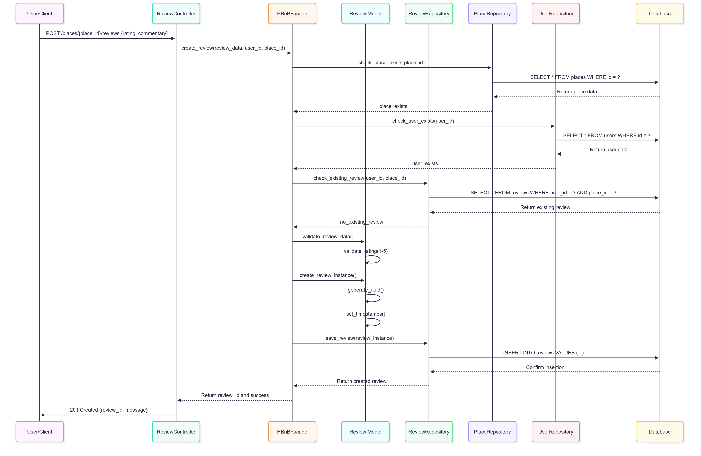
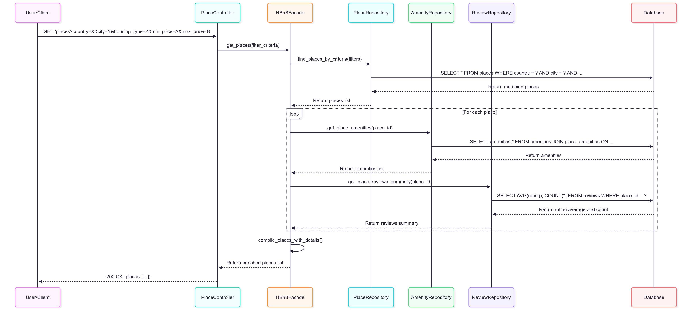

# 🧾 Technical Documentation – HBnB Evolution Project

---

## 🔰 Introduction

This technical documentation was written as part of the HBnB Evolution project, a web application that allows users to post or book accommodations, leave reviews, and filter results based on their needs.

The goal of this document is to provide a **clear and structured overview** of the technical functioning of the application. It includes the **software architecture**, **main entities**, and **interactions between the different system layers**.  

Each diagram is accompanied by detailed explanations, so that everyone (developers, reviewers, POs, etc.) can understand the overall operation of the application.

---

## 📦 Architecture Diagram – Layered Architecture

### 🧱 Three Layers, Three Roles

This diagram represents the technical organization of our **HBnB** application into **three main layers**, each with a well-defined role. This is called a **layered architecture**, widely used to structure modern web applications.

  

---

### 1. Presentation (`PresentationLayer`)

> 🎯 This is the **layer that interacts with the user**.

- It receives clicks, forms, requests (website or mobile app).
- It contains the **controllers** that link user actions to internal logic.

**Main Controllers:**
- `UserController`: handles signup, login, etc.
- `PlaceController`: creation, modification of listings.
- `ReviewController`: user reviews.
- `AmenityController`: amenities (WiFi, pool, etc.).

When a user clicks a button, it's **one of these controllers** that receives the info and passes it to the system.

---

### 2. Business Logic (`BusinessLogicLayer`)

> 🧠 This is the **core of the app**.

It contains:
- the **business models** (`User`, `Place`, `Review`, `Amenity`)  
- the **central facade** `HBnBFacade` that links controllers to models

All business rules are managed here: validation, processing, calculations.

The controller **never speaks directly to a model**; it goes through `HBnBFacade`, which keeps the code clean and avoids tight coupling.

---

### 3. Persistence (`PersistenceLayer`)

> 💾 This is the data layer.

- It stores and retrieves objects from the database.
- It contains the **repositories**:  
  `UserRepository`, `PlaceRepository`, `ReviewRepository`, `AmenityRepository`.

Each repository is specialized in data access for one model.

---

### 🔄 How Do Layers Communicate?

- The user clicks → the **controller** sends to the facade.
- The **facade** calls the right models.
- The **models** use the repositories to access the database.
- The **response** goes back up to the user.

> 📌 Why this structure?
- Better organization (each part has its role)
- Scalability (you can change the database without affecting logic)
- Easier maintenance

---

## 🧩 Class Diagram – Business Logic Layer

This diagram shows the main **business entities** used in the app.  
Each entity corresponds to a real object handled by the user or the system.

  

---

### 🧬 Parent Class: `BaseEntity`

To avoid repeating the same attributes everywhere, we created a common abstract class.

**Standard attributes** (present in all entities):
- `id`: UUID4 identifier
- `created_at`: creation date
- `updated_at`: last update date

All classes inherit from this base structure. This ensures a consistent logic and facilitates object tracing and serialization.

---

### 👤 User (`User`)

A user can:
- sign up, log in
- publish listings
- leave reviews

**Attributes:**
- `first_name`, `last_name`, `email`, `username`, `password`
- `is_admin`: boolean for admin rights

**Methods:**
- `register()`, `update_profile()`, `del_profile()`
- `is_admin()`: checks permissions

---

### 🏠 Place (`Place`)

A place contains location info, description, price, etc.

**Attributes:**
- `country`, `city`, `address`, `description`
- `housing_type`, `room_count`, `price`
- `latitude`, `longitude`

**Methods:**
- `create_place()`, `update_place()`, `delete_place()`, `list_places()`

---

### ✍️ Review (`Review`)

A user can leave a review on a place they visited.

**Attributes:**
- `user_id`, `place_id`
- `rating`, `commentary`

**Methods:**
- `create_review()`, `update_review()`, `delete_review()`, `list_reviews()`

---

### 🛠️ Amenity (`Amenity`)

An amenity can be shared across multiple places.

**Attributes:**
- `type`, `description`

**Methods:**
- `create_amenity()`, `update_amenity()`, `delete_amenity()`, `list_amenity()`

---

### 🎛️ Business Facade (`HBnBFacade`)

This is the **main interface used by controllers** to interact with business logic.

**Methods:**
- `register_user()`, `create_place()`, `add_review()`, `list_amenities()`, `get_user_profile()`

It **simplifies access** to business features by centralizing logic calls.

---

### 🔗 Entity Relationships

- **Inheritance:** all entities inherit from `BaseEntity`
- **Aggregations:**
  - `User` owns multiple `Place`
  - `User` writes multiple `Review`
  - `User` can create `Amenity`
- **Compositions:**
  - `Place` contains multiple `Review` (if deleted → reviews are too)
- **Multiple associations:**
  - `Place` uses multiple `Amenity` (and vice versa)

---

## 🔁 Sequence Diagrams – API Calls

Sequence diagrams tell a **real user story**, showing everything that happens **from click to database**, step by step.

Each scenario is concrete and explained with a real-life example.

---

### 1. ✍️ User Registration

> Léa wants to sign up on HBnB.

1. She fills in the form (email, password…)
2. The website sends a `POST /users/registration` request
3. The controller calls `register_user()` in `HBnBFacade`
4. Validation:
   - `check_email_format()`
   - `hash_password()`
   - `check_email_exists()` via `UserRepository`
5. If everything is valid:
   - Create user instance
   - `generate_uuid()`
   - `set_timestamps()`
6. Save user: `save_user(user_instance)`
7. Return: `201 Created` with `user_id`

**Example:** If “lea@gmail.com” already exists → error message is returned.

---

### 2. 🏡 Place Creation

> Paul wants to publish his apartment in Fréjus.

1. He submits the form (country, price, address…)
2. `POST /places` → handled by `PlaceController`
3. Calls `create_place(data, user_id)` in `HBnBFacade`
4. Validation:
   - `validate_coordinates()`
   - `validate_price()`
   - `validate_amenities()` via `AmenityRepository`

5. If valid:
   - Create place instance
   - `generate_uuid()`
   - `set_timestamps()`
6. Save place: `save_place()`
7. Link place to selected amenities via `place_amenities`
8. Return: `201 Created` with `place_id`

**Example:** If Paul selects “WiFi” and “Pool” → the system checks if those amenities exist.

---

### 3. ⭐ Review Submission

> Léa wants to leave a review on Paul’s place.

1. She writes her comment and rating
2. `POST /places/{place_id}/reviews`
3. Controller calls `create_review(data, user_id, place_id)` in `HBnBFacade`
4. Validation:
   - `check_place_exists()`
   - `check_user_exists()`
   - `check_existing_review()`
   - `validate_rating()` (range 1 to 5)

5. If valid:
   - Create review instance
   - `generate_uuid()`
   - `set_timestamps()`
6. Save review: `save_review()`
7. Return: “Thanks for your review!” → `201 Created`

**Example:** If Léa tries to review the same place twice → error returned.

---

### 4. 🔍 Fetching Places

> Léa searches for a place in Fréjus with WiFi and a budget under €100.

1. She enters her filters → `GET /places?...`
2. The request is handled by `PlaceController`
3. Calls `get_places(criteria)` in `HBnBFacade`
4. `PlaceRepository.find_places_by_criteria()` executes a DB query:
   - City = Fréjus
   - Max price = 100 €
   - Amenities include WiFi

5. For each result:
   - Get amenities with `AmenityRepository.get_place_amenities(place_id)`
   - Get review summary with `ReviewRepository.get_place_reviews_summary(place_id)`

6. `HBnBFacade.compile_places_with_details()` merges everything
7. Return: list of enriched places with price, rating, amenities → `200 OK`

**Example Displayed:**
> “Cozy Studio, €90, WiFi, 4.7/5 stars (15 reviews)”

---

## Conclusion

This document brings together everything needed to **understand, build, and maintain** the HBnB project.  
Each section (architecture, entities, sequences) was designed to be **readable and directly usable** by the technical team.

> It’s now ready to serve as a **reference during development**, technical reviews, or even interviews.
